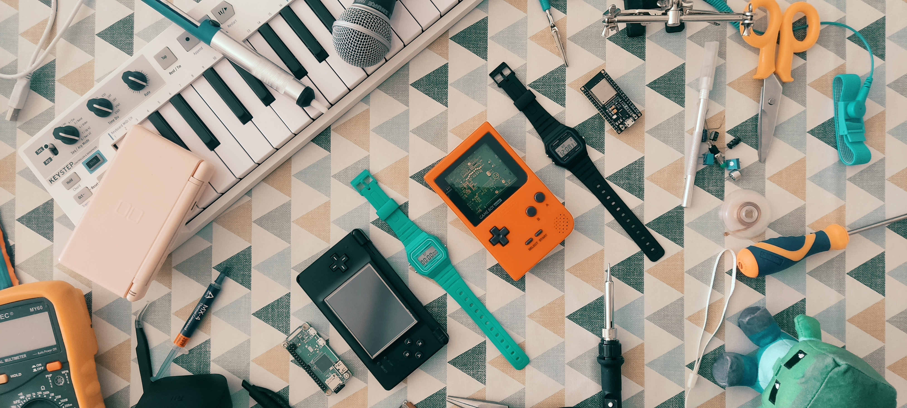

# About me
Problem solver. I like creating and constructing with the help of technology. I love learning and discovering new things. Enthusiastic about finding simple solutions to complex problems and focused on delivering them efficiently and professionally.

# Skills
Team and project management, QA, test environment and test strategy designer. Product and system integration, V&V cycle. Python and C programming. Experience in
Linux, git, pytest, cryptography and more. Experience in electronics, embedded platforms and embedded programming, and IoT.

# Previous Jobs
## QA and Security Engineer at Techteamz
**Period:** June 2022 - Now  
**Main tasks:** QA and testing of a Root of Trust embedded system (cryptography, test automation, test planning, C and Python programming). Leading a team of 7 people. International relations. Documentation.

## Validation and Product Integration Engineer at Siemens Rail Automation
**Period:** Nov 2020 - Des 2021  
**Main tasks:** testing and integration of real ERTMS equipment, automatization of  processes, test environment design, hardware assembly and maintenance. Supervision of team tasks. Full documentation cycle.

## Validation Software Engineer at Expleo Group
**Period:** Sept 2017 - Nov 2020  
**Main tasks:** Software validation and test creation. Hardware maintenance, tool design and development. Supervision of team tasks. Full documentation cycle.

# Education
Degree in Industrial Electronics and Automation Engineering from Universitat Rovira i Virgili 2009-2017

# Other Interests
Environment conservation and nature. Curious about science and discovery. I spend my free time restoring retro consoles and tinkering with IoT devices. I write scripts and build simple devices for fun. I try to contribute to the open source community as much as I can.